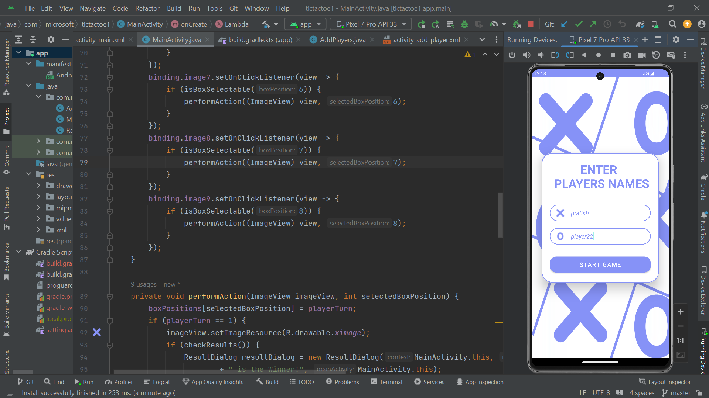
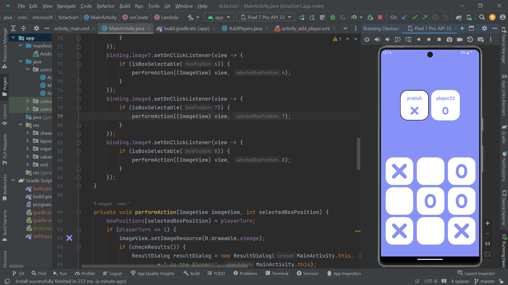
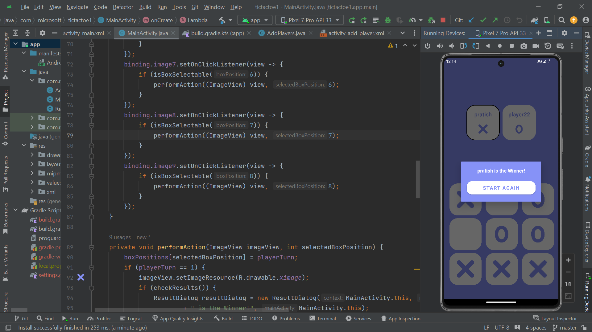

# Tic-Tac-Toe Android App

## Overview

This is a simple Tic-Tac-Toe game implemented for Android. The application allows two players to play Tic-Tac-Toe on the same device. It includes functionality for entering player names, switching turns, and displaying the result of the game.

## Features

- **Player Input**: Enter names for Player One and Player Two.
- **Game Board**: A 3x3 grid where players take turns to place their mark (X or O).
- **Turn Management**: The game alternates turns between the two players.
- **Result Notification**: Displays a dialog when a player wins or when the game is a draw.
- **Restart Game**: Allows restarting the game to play again.

## Screenshots





## Installation

1. **Clone the Repository**:

   ```bash
   git clone https://github.com/pratish444/tictactoe_app.git
